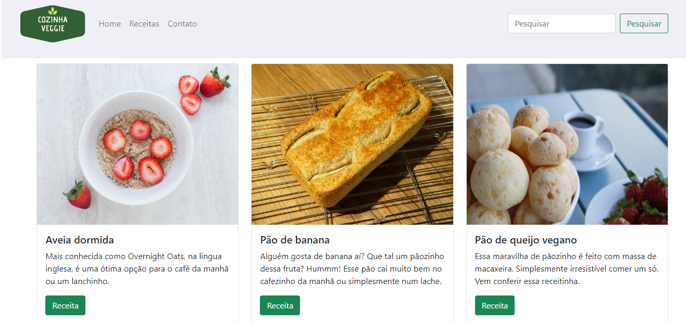

<h1 align="center"> Cozinha veggie </h1>

  <a href="#-tecnologias">Tecnologias</a>&nbsp;&nbsp;&nbsp;|&nbsp;&nbsp;&nbsp;
  <a href="#-projeto">Projeto</a>&nbsp;&nbsp;&nbsp;|&nbsp;&nbsp;&nbsp;

 

# Página principal

   

## 🚀 Tecnologias

Esse projeto foi desenvolvido com as seguintes tecnologias:

- HTML e CSS
- Bootstrap
- Git e Github

## 💻 Projeto

Uma página web para estudo e treino das tecnologias envolvidas.

[Visite o projeto online] : https://projeto-cozinha-veggie.vercel.app/

---
